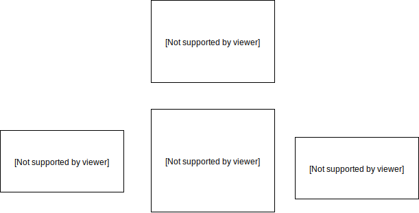
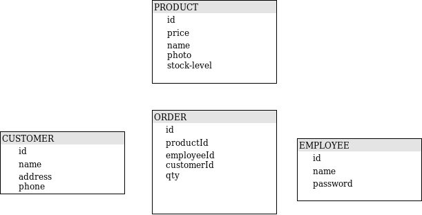
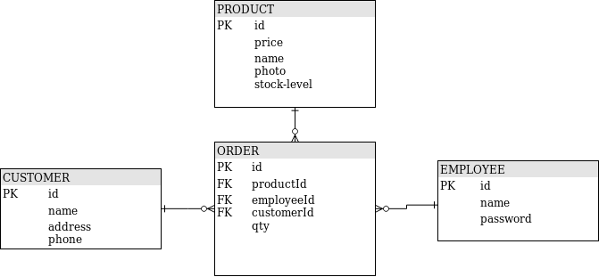

% Bazy danych - zadania

## Zadanie 1

Zainstaluj silnik wybranej bazy danych, np. 
<a href="https://www.postgresql.org/download/" target="_blank">PostgreSQL</a>.

Możesz też zainstalować uniwersalne narzędzie do
prac programistycznych z bazą danych, np. 
<a href="https://dbeaver.io/" target="_blank">DBeaver</a>.

Zweryfikuj poprawność instalacji i konfiguracji bazy danych
łącząc się ze swoją bazą danych z narzędzia. 

## Zadanie 2

Utwórz schemat danych oraz tabele na podstawie diagramu.

## Zadanie 3

Zmieniamy konwencję nazewniczą, zodyfikujemy strukturę tabeli.
Zmodyfikuj tabele z poprzedniego zadania na podstawie diagramu:

Zmianę nazwy przeprowadź modyfikując strukturę
istniejącej bazy danych, a nie usuwając starą bazę
i tworząc ją jeszcze raz :)  

## Zadanie 4

Wykonaj instrukcje:
* dodającą jeden wiersz do tabeli z produktami,
* dodającą dwa wiersze do tabeli z produktami.

Jako `id` użyj kolejnych liczb 1, 2, 3... 

## Zadanie 5

Wykonaj instrukcję, która zmieni nazwę produktu z `id` równym 1.
 

## Zadanie 6

Wykonaj instrukcję, która usunie produkt o `id` równym 2.

 
## Zadanie 7* 

Korzystając z języka definicji danych
dostosuj bazę tak aby wartość klucza głównego
w każdej z tabel była generowana automatycznie 
przy dodawaniu nowych.

<a href="https://stackoverflow.com/a/9490532/2045440" target="_blank">https://stackoverflow.com/a/9490532/2045440</a>

## Zadanie 8.1
Wykonaj zapytanie, które wypisze wszystkie produkty.
 
## Zadanie 8.2
Wykonaj zapytanie, które wypisze identyfikatory i stany magazynowe produktów.
 
## Zadanie 8.3
Wykonaj zapytanie, które policzy ile mamy produktów.
 
## Zadanie 8.4
Wykonaj zapytanie, które wypisze dane produktu o `id` równym 3.

## Zadanie 8.5
Wykonaj zapytanie, które wypisze dane produktu o `id` mniejszym niż 3 i cenie większej od 10.
 
## Zadanie 8.6
Wykonaj zapytanie, które wypisze produkty bez zdjęcia.
 
## Zadanie 8.7
Wykonaj zapytanie, które wypisze dane produktów:
* zawierajacych literę `a` w nazwie 
 
## Zadanie 8.8
Wykonaj zapytanie, które wypisze dane produktów:
 * ułożone według cen od najniższej do najwyższej
 * ułożone według cen od najwyższej do najniższej

## Zadanie 8.9

Dodaj kilka wierszy do tabeli zamówień.
 
Wykonaj zapytanie, które wypisze zamówienia pogrupowane
według klientów.

## Zadanie 8.10

Wykonaj zapytanie, które wypisze zamówienia pogrupowane
według klientów i wartość największego zamówienia każdego z nich.

## Zadanie 8.11

Wykonaj zapytanie, które wypisze zamówienia pogrupowane
według klientów i wskaże sumę zamówień każdego z nich,
biorąc pod uwagę tylko tych, dla których ta suma była większa niż 100.

## Zadanie 9

Zmodyfikuj schemat bazy danych tak, aby uwzględniał powiązania (FK) pomiędzy tabelami, 
zgodnie z poniższym schematem:

 

## Zadanie 10.1

Wykonaj zapytanie, które zwróci listę
zamówień wraz z informacjami o obsługujących je pracownikach
(z uwzględnieniem tylko zamówienia przypisane do pracowników).

## Zadanie 10.2

Wykonaj zapytanie, które zwróci listę
zamówień wraz z informacjami o obsługujących je pracownikach
(uwzględniająć wszystkie zamówienia, nawet te nieprzypisane do pracowników).

## Zadanie 10.3

Wykonaj zapytanie, które zwróci listę
pracowników wraz z informacjami o przypisanych do nich zamówieniach
(uwzględniająć wszystkich pracowników, nawet tych bez zamówień).

