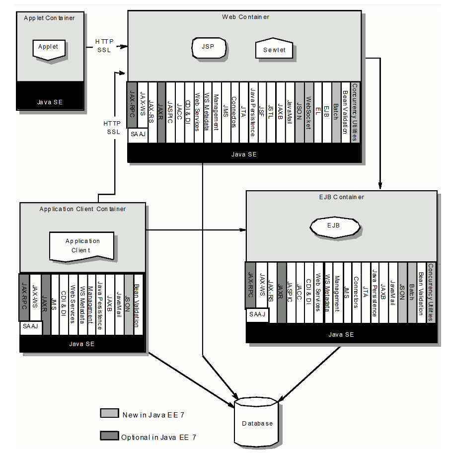

% JavaEE

# Intro

## Multi-tier web applications


## What is Java EE?

**Java Platform, Enterprise Edition** - 
is a set of specifications, extending Java SE with specifications for enterprise features.

Known as:

* J2EE (1999)
* Java EE (2006)
* Jakarta EE (2019)

## Application servers

Application servers:
* Glassfish
* JBoss AS / JBoss Wildfly
* Apache TomEE

Application containers:
* Apache Tomcat
* Eclipse Jetty


## Specifications



<!--
Java SE 6 included a full Web Services stack for the convenience of Java developers.
https://openjdk.java.net/jeps/320

https://jaxenter.com/jdk-11-java-ee-modules-140674.html
https://dzone.com/articles/apis-to-be-removed-from-java-11

https://jakarta.ee/specifications/platform/8/platform-spec-8.html

https://stackoverflow.com/questions/48204141/replacements-for-deprecated-jpms-modules-with-java-ee-apis


Earlier:

Differences between Java EE and Java SE
Java technology is both a programming language and a platform. The Java programming
language is a high-level object-oriented language that has a particular syntax and style. A Java
platform is a particular environment in which Java programming language applications run.
There are several Java platforms.Many developers, even long-time Java programming language
developers, do not understand how the different platforms relate to each other.
The Java Programming Language Platforms
There are four platforms of the Java programming language:
■ Java Platform, Standard Edition (Java SE)
■ Java Platform, Enterprise Edition (Java EE)
■ Java Platform,Micro Edition (Java ME)
■ JavaFX


java platform editions:

https://docs.oracle.com/javaee/6/firstcup/doc/gkhoy.html
https://javaee.github.io/firstcup/java-ee001.html#GCTOG

https://stackoverflow.com/questions/2857376/difference-between-java-se-ee-me
https://www.oracle.com/java/technologies/java-ee-glance.html
https://en.wikipedia.org/wiki/Java_Platform,_Enterprise_Edition


into to ee

https://javaee.github.io/tutorial/
https://javaee.github.io/tutorial/overview008.html#java-api-for-json-binding

https://github.com/javaee/tutorial-examples

https://docs.oracle.com/javaee/6/tutorial/doc/ ,  https://docs.oracle.com/javaee/6/tutorial/doc/javaeetutorial6.pdf


https://docs.jboss.org/author/display/WFLY10/Getting+Started+Developing+Applications+Guide
https://docs.wildfly.org/18/Getting_Started_Developing_Applications_Guide.html#cdi-servlet-helloworld-quickstart
https://docs.wildfly.org/18/Getting_Started_Guide.html

http://balusc.omnifaces.org/2014/10/jsf-22-tutorial-with-eclipse-and-wildfly.html
https://examples.javacodegeeks.com/enterprise-java/jsf/jsf-crud-application-example/
https://docs.wildfly.org/18/

-->

# Simple Java EE application

## Application server installation

* <a href="java-ee-tasks.html#/zadanie-1" target="_blank">[Task 1]</a>

## Application setup

* <a href="java-ee-tasks.html#/zadanie-2" target="_blank">[Task 2]</a>


# Chosen specifications

## Servlet

**Java servlet** -  is a Java software component that extends the capabilities of a server.

## Servlet - declaration
```
public class MyServlet extends HttpServlet {
}
```

## Servlet - configuration

* Annotated by `@WebServlet`

* `web.xml`

 

## Servlet - tasks

* <a href="java-ee-tasks.html#/zadanie-3" target="_blank">[Task 3]</a>


## Servlet - request parameters

```
request.getParameter(String)
```

## Servlet - request parameters - task 

* <a href="java-ee-tasks.html#/zadanie-4" target="_blank">[Task 4]</a>

## CDI

**CDI (Contexts and Dependency Injection)** - is a standard dependency injection framework included in Java EE 6 and higher.

## CDI - Dependency Injection motivation

Wiring everything together is a tedious part of application development. There are several approaches to connect data, service, and presentation classes to one another. 

## CDI - Maven

```
    <dependency>
      <groupId>jakarta.inject</groupId>
      <artifactId>jakarta.inject-api</artifactId>
      <version>1.0</version>
    </dependency>
```

## CDI - `beans.xml`
```
<?xml version="1.0" encoding="UTF-8"?>
<beans xmlns="http://xmlns.jcp.org/xml/ns/javaee" xmlns:xsi="http://www.w3.org/2001/XMLSchema-instance"
    xsi:schemaLocation="http://xmlns.jcp.org/xml/ns/javaee http://xmlns.jcp.org/xml/ns/javaee/beans_1_1.xsd"
    bean-discovery-mode="all">
</beans>
```

## CDI - using beans

* `@Inject`

## CDI - tasks

* <a href="java-ee-tasks.html#/zadanie-5" target="_blank">[Task 5]</a>

## JAX-RS


# Other

## JAX-WS

## JSP

## JSF

## JPA

## EJB
 

